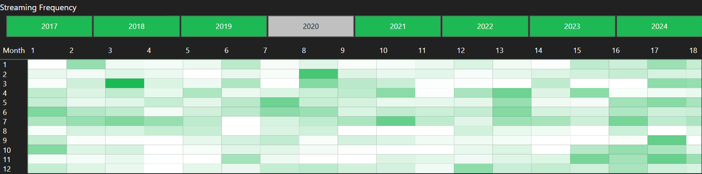

# 🎵 Spotify Music Streaming Dashboard 

## Overview
This project analyzes my **personal Spotify streaming history** using an interactive **Power BI dashboard**. It focuses on year-specific trends, such as **top artists**, **favourite tracks**, **streaming frequency**, and identifying periods when I streamed music offline (usually while travelling). The dashboard combines data visualization and storytelling to uncover insights into how my listening habits evolved over the years.

---

## Objectives
The main objectives of this project were:
- To analyze **year-specific streaming trends**, including favorite artists and tracks.
- To visualize **monthly and yearly patterns** in streaming frequency.
- To identify periods of **offline streaming**, particularly during travel.
- To calculate and visualize an **Enjoyment Index**, a metric that reflects listening satisfaction.

---

## Dataset
The data was exported from Spotify's **Streaming History** files and contained:
- **Track Name**: Name of the song played.
- **Artist Name**: The performer or band associated with the track.
- **ms_played**: Duration the track was played, in milliseconds.
- **Date and Time**: Timestamp of when the track was played.
- **Offline/Online Mode**: Whether the streaming occurred online or offline.

### Data Cleaning and Transformation
Key transformations performed on the data:
1. Converted `ms_played` into **hours** for better readability.
2. Extracted **Year** and **Month** from timestamps for time-based analysis.
3. Created calculated fields and measures, such as:
   - **Total Playtime**: Aggregated playtime for tracks, artists, and time periods.
   - **Play Count**: Count of how many times each track or artist was played.
   - **Enjoyment Index**: Ratio of playtime to skips to measure engagement.
   - **Offline Stream Time**: Aggregated streaming time during offline playback.

---

## Dashboard Features

###  Cumulative Time Played (hrs)
A bar chart visualizing the total streaming time by year. It highlights my most active streaming years and provides an overview of listening trends over time.

---

###  Enjoyment Index by Month
A custom metric that quantifies my listening satisfaction on a monthly basis, calculated as the ratio of playtime to skips. This chart highlights months where I was most engaged with my music.

---

###  Top Artists and Tracks (Year-Specific)
Two separate tables showcasing:
- **Top Artists**: Ranked by total streaming time for each year.
- **Top Tracks**: Ranked by playtime and number of plays within each year.

---

###  Streaming Frequency Heatmap
A heatmap that visualizes my streaming activity by month and year. It highlights seasonal patterns and identifies periods of high streaming frequency.

---

###  Offline Streaming Time
A bar chart focusing on offline streaming activity. It reflects periods when I relied on downloaded music, such as during travel.

---

## Insights
### Key Takeaways:
1. **Peak Streaming Year**:
   - 2020 was my most active streaming year, with over **1,000 hours** of music played.
2. **Year-Specific Trends**:
   - Artists like **Billie Eilish**, **Anirudh Ravichander**, and **A.R. Rahman** dominated my listening habits in 2020, with notable variations across different years.
   - Tracks such as *"No Time to Die"* and *"Everything I Wanted"*  were among my most played songs during this period, reflecting my evolving musical preferences.
3. **Seasonal Patterns**:
   - **May** and **October** consistently emerged as peak streaming months.
4. **Offline Streaming During Travel**:
   - Offline streaming activity peaked in 2020, likely coinciding with periods of travel when I relied on downloaded music.

---

## Tools and Techniques

### Tools:
- **Power BI**: Used for creating interactive visuals and designing the dashboard.
- **DAX**: Developed custom calculations and metrics for play counts, rankings, and offline streaming analysis.

### Techniques:
- **Data Cleaning**: Processed raw Spotify data to handle duplicates, missing values, and timestamp formatting.
- **Visualization Design**: Created visuals that align with storytelling objectives to make insights intuitive.

---

## How to Use the Dashboard

1. Use the **year slicer** to explore year-specific trends for the heatmap, most played tracks and favourite artists.
2. Hover over the **heatmap** to view streaming frequency details for a specific month and year.

---

## Acknowledgments
This project was driven by my love for music and curiosity about my listening habits. I utilized Spotify's streaming history export feature to access and analyze my personal data, showcasing how we can derive meaningful insights from the data we own.

---

## Connect With Me
If you found this project interesting:
- Let’s connect and discuss your insights on [LinkedIn](https://www.linkedin.com/in/sai-shanmukh/)

Feel free to share your thoughts or let me know how you analyze your streaming data!
